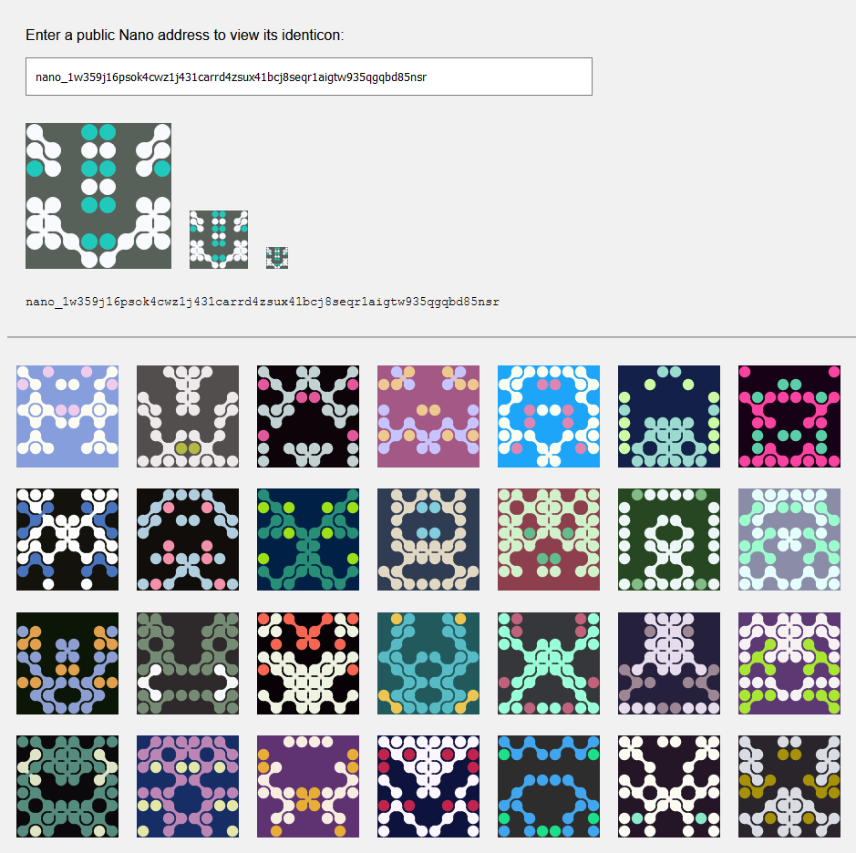

Nanoidenticons
========

A tiny library for generating identicons, based on [Blockies](https://github.com/download13/blockies).



[**Demo page**](https://keerifox.github.io/Nanoidenticons/)

Browser
---

```javascript
import { createIcon } from '@keerifox/nanoidenticons';

var icon = createIcon({
    seed: 'nano_1234...', // seed used to generate icon data, default: random
    scale: 16 // width/height of each block in pixels, default: 4
});

document.body.appendChild(icon); // icon is a canvas element
```

In the above example the icon will be 8x8 blocks, and each block will be 16x16 pixels. The icon canvas will be 128x128 pixels.

Node
---

```javascript
import { createCanvas } from 'canvas'; 
import { renderIcon } from '@keerifox/nanoidenticons';

const canvas = createCanvas(128, 128);

var icon = renderIcon(
    {
        seed: 'nano_1234...', // seed used to generate icon data, default: random
        scale: 16 // width/height of each block in pixels, default: 4
    },
    canvas
);
```


Notes
-----

The defaults of scale 4 generate 32x32 pixel icons. Below are some standard sizes that work well.
 * 32x32 `{scale: 4}`
 * 64x64 `{scale: 8}`
 * 128x128 `{scale: 16}`


Build
-----

    npm run build

License
-------

[WTFPL](http://www.wtfpl.net/)
